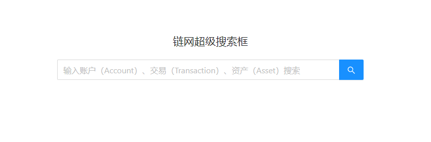
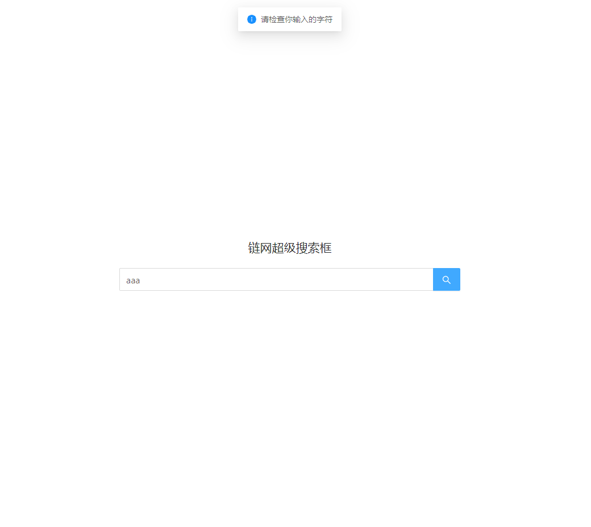
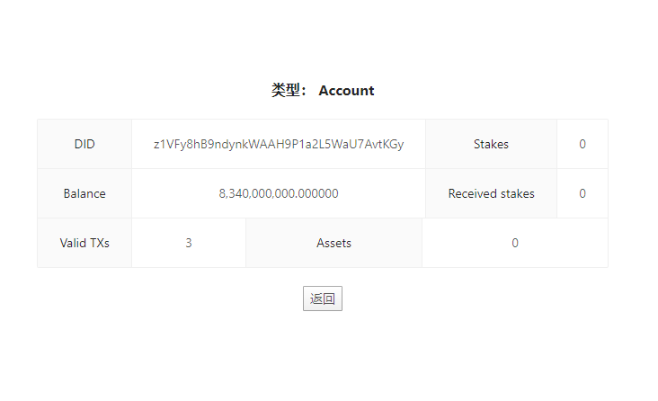
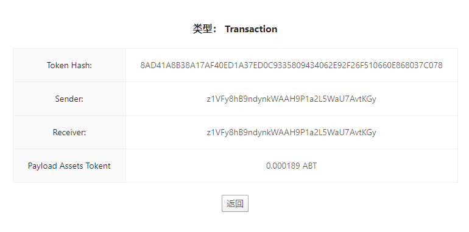
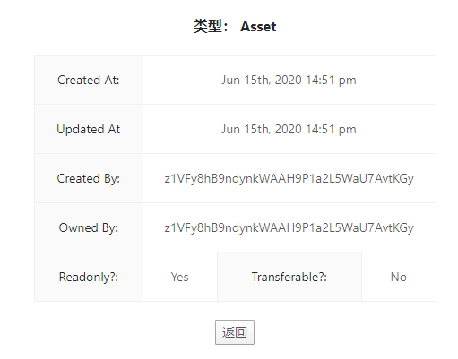

# 如何在两天之内学会 ArcBlock 区块链开发


UPDATE： 

    抱歉此项目只是一时生气为抱怨被骗子公司浪费了两天时间所创建的，无实际内容。
    本来准备删掉，想想还是更新一下，请各位开发者不要被骗。
    ArcBlock 共识基石 常年以美国公司，远程，高薪，高福利为由在各个开发者网站，招聘开发者，被骗者无数。 
    实为三无公司，一共两三个人，无办公地点，白嫖开发者时间，以测试他们的站点，刷流量。 各位小心。
    区块链割韭菜无可厚非，https://www.chainnode.com/post/353626 ，连开发者都割就太说不过去了


---


此项目源于一条招聘信息：

[ArcBlock 正在热招 Node.js 全栈工程师](https://zhuanlan.zhihu.com/p/146561992)

我抱着试试看的态度发了简历，得到回复需要先做个 `Coding Test`。

我觉得没什么问题，来考吧！ 结果对方发来了一大篇 `ABT Node` 的介绍，简单说是让我做一个他们规定的 `Blocklet`

什么是 `Blocklet` ? 他们又贴了一个规范 https://github.com/ArcBlock/blocklet-spec

要求 react 做前端和 express 做后端。部署到`ABT Node`节点上，运行节点还要用手机安装他们的`手机钱包`做认证

然后需要调用他们的 `API` 来进行搜索。要在一周之内做完。

我当时问 这也太平台相关了 ，这简直就是是学会使用 `abt-node`，变相宣传啊。

对方给到的回复 `这个测试是为了考察候选人学习能力和实际代码能力。`

好吧，有点道理，整个扑在这上边吧 ，周末带孩子计划取消，老婆怨声载道不管了，装节点，装钱包，读文档。

掏出许久没用的 `create-react-app` 因为好久没用`react`为了不丢人，还特意学了 `hook` 再写...

经过认真研究 `Blocklet` 和相关文档，终于明白了高大上的包装下，其实简单说`ArcBlock`节点就是个`node`运行环境，上边运行的 `node` 程序 (express) 就叫 `blocklet` 了 ， 就是要按他们的参数配置些参数，用他们的命令行部署。。。

经过九九八十一卡`bug`，`docker`版节点运行总提示丢配置文件，中途邮件又提了几个问题，`api`不稳定时好时坏，折腾了整个周末终于写好了，怕对方看不懂还写了`README`，并截了图。 发了代码过去。

得到的反馈是：

```
你好！

我们已经完成对你 Coding Test 代码的 Review，很抱歉的通知你，你提交的 Coding Test 代码未能通过我们的评审。

感谢你在应聘这个职位所投入的时间和精力，期望以后有机会再合作！

祝顺利！

XXX ，ArcBlock
```

哎。好吧，都搞定了还没通过评审，别人的时间都不时间。就把代码发到这里吧，留个纪念吧。

## 代码结构

```bash
abt-node
  |
  |----- client/ # 客户端 create-react-app 生成的源码目录
  |       |----- App.tsx         # 客户端入口，使用 react-router 跳转 下边两个页面
  |       |----- Home.tsx        # 搜索框，使用 ant-design 作为 ui，发送搜索请求
  |       |----- Result.tsx      # 根据返回搜索结果的类型，显示对应的结果
  |----- src/    # 服务端 express 源码目录
          |----- index.ts        # 服务端入口，接收 post 请求，调用 searcher 搜索并返回结果
          |----- searcher.ts     # ForgeSDK 的封装，支持3条链的并发搜索
```

# 截图







## TODO

api 不定期抽风，暂时显示的是假数据。
